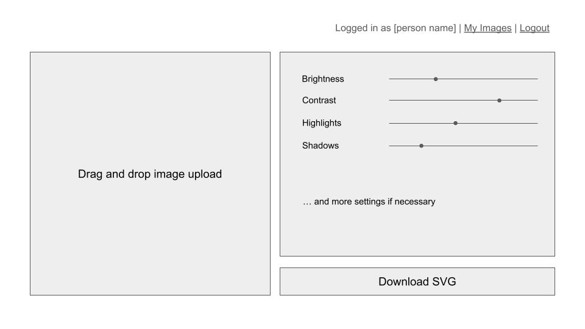
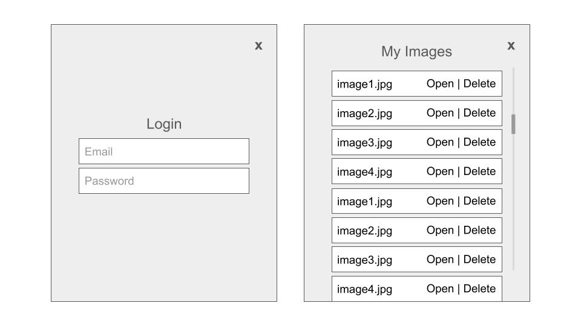

# CS 260 Startup Project
[Notes](https://github.com/kayleigh-gustafson/startup/blob/main/notes.md)
## Elevator Pitch
There are a lot of ways to create art, and it's not uncommon to combine them. I prefer to do sketches and line art on paper, but I love coloring things digitally. This application will help me and those like me! Users will upload a scan or a photo of their pen-and-paper line art, and the web app will use a vector API to convert the bitmap image into a smooth, clean vector line art file that's ready to use in a digital art program. Other use cases could include vectorizing logos or hand-drawn fonts.

## Key Features
- Log in to save art and preferences
- Upload an image from your device
- User can adjust filters (brightness, contrast, etc) to make the line art as clear as possible
- Convert filtered bitmap image into a clean vector file with a transparent background
- Download converted files
## Technologies
- HTML: Structure the 
- CSS:
- React:
- Web Service:
- Authentication:
- Database:
- WebSocket: Update a preview of the final result in real time