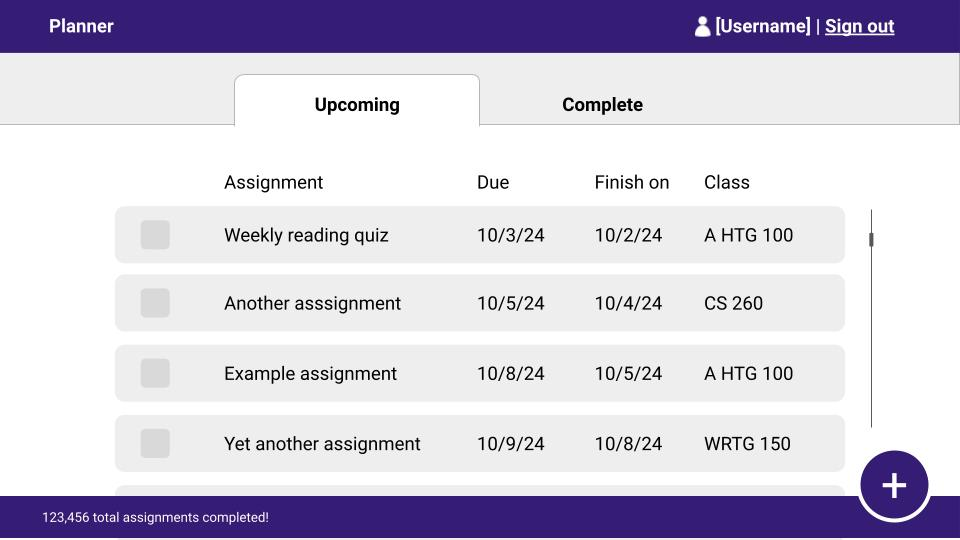
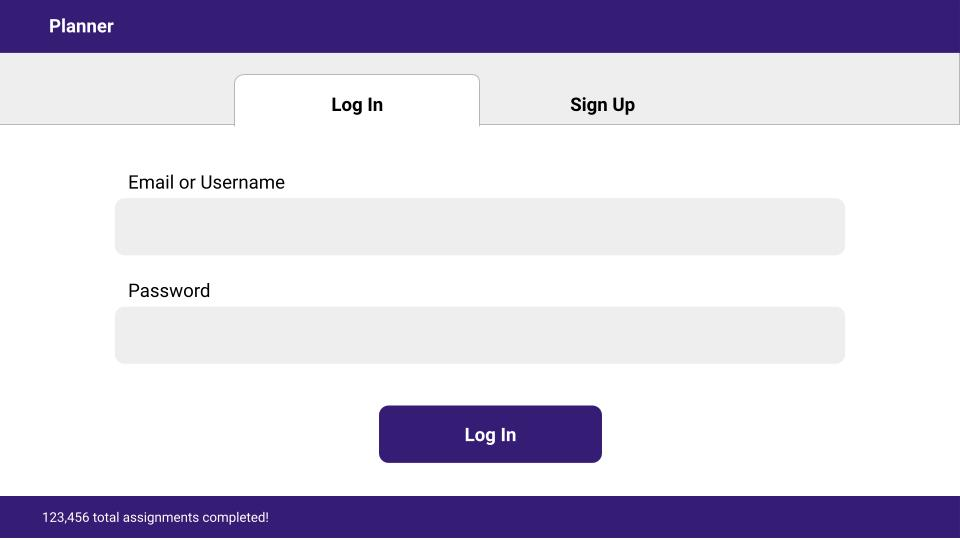
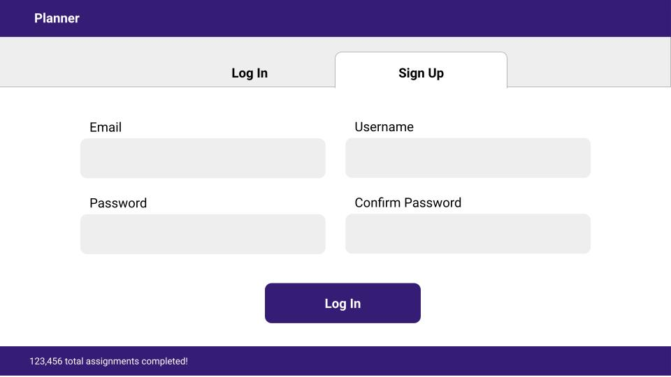
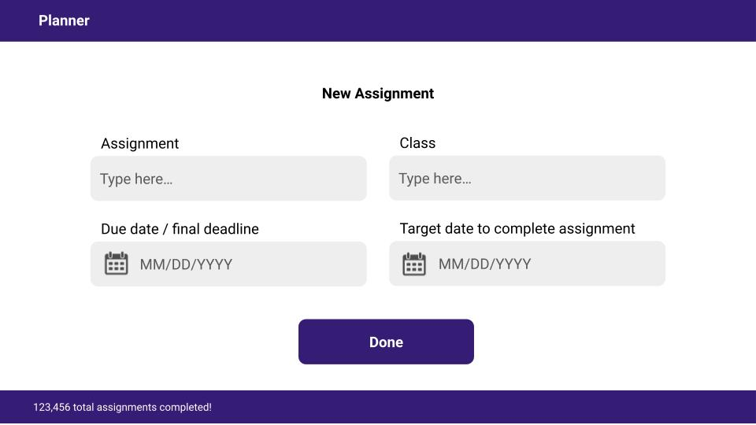

# CS 260 Startup Project
## Elevator Pitch
As a freshman starting her first semester of college, the number of assignments can be overwhelming. At the moment, I have a spreadsheet with all of my assignments for the semester, and I know some of my friends and roommates have similar solutions. My web app, an assignment planner, will aim to make organizing and remembering assignments easier.

## Key Features
- Create new assignments and specify a name, a class, the due date, and the date you want to finish the assignment
- Log in to save assignments
- Check off completed assignments
- View completed assignments in a separate tab
- Sort assignments by date
- Tap on part of an assignment (such as the due date) to edit it
## Technologies
- **HTML**: Website structure, including a header and footer, buttons, text and date input for assignments
- **CSS**: Style website to look nice and use whitespace well, and use an attractive color palette and font scheme
- **React**: Add interactivity such as switching between tabs, initiating login and logout, and adding and completing assignments
- **Web Service**: Email API to notify users if they have an assignment due
- **Authentication**: User logs in with an email (or username) and password to access their personal list of assignments
- **Database**: Save user's assignments so they can access them again later
- **WebSocket**: Real-time counter (in the footer) of how many assignments have been completed using the app
## HTML Deliverable
- [x] **HTML pages for each component of your application:** Log in/sign up page, main page, and new assignment page: Done
- [x] **Proper use of HTML tags including BODY, NAV, MAIN, HEADER, FOOTER:** Done
- [x] **Links between pages as necessary:** Done
- [x] **Application textual content:** Done
- [x] **Placeholder for 3rd party service calls:** User can check boxes to indicate whether they would like an email notification: Done (A third party service will be used to send the emails)
- [x] **Application images:** Icons for various inputs (email, password, etc)
- [x] **Login placeholder, including user name display:** Done
- [x] **Database data placeholder showing content stored in the database:** Placeholder list of user's assignments: Done
- [x] **WebSocket data placeholder showing where realtime communication will go:** Placeholder for real-time counter of the total number of assignments that everyone has completed: Done
## CSS Deliverable
This deliverable involved adding a lot of Bootstrap elements, adjusting padding, making dropdowns and dialog boxes, and making the webpage responsive.
- [x] Header, footer, and main content body: done
- [x] Navigation elements: Brand (home page link) on all navbars, "add" button and user button on navbars for all logged-in pages, term switching button on main and class pages
- [x] Responsive to window resizing: done
- [x] Application elements: done
- [x] Application text content: done
- [x] Application images: "Add" icon, favicon: done

