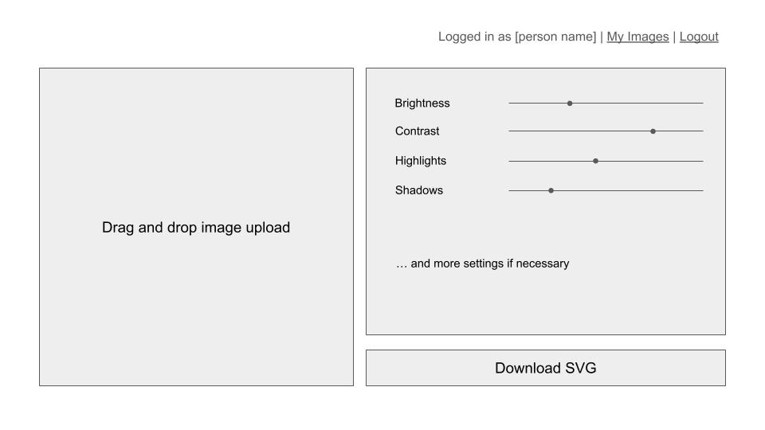
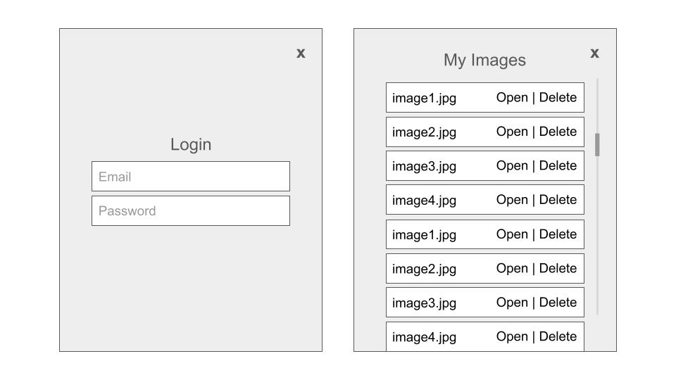

# CS 260 Startup Project
## Elevator Pitch
There are a lot of ways to create art, and it's not uncommon to combine them. I prefer to do sketches and line art on paper, but I love coloring things digitally. This application will help me and those like me! Users will upload a scan or a photo of their pen-and-paper line art, and the web app will use a vector API to convert the bitmap image into a smooth, clean vector line art file that's ready to use in a digital art program. Other use cases could include vectorizing logos or hand-drawn fonts.

## Key Features
- Log in to save art and preferences
- Upload an image from your device
- User can adjust filters (brightness, contrast, etc) to make the line art as clear as possible
- Convert filtered bitmap image into a clean vector file with a transparent background
- Download converted files
## Technologies
- **HTML**: File input, image filter sliders, structure of the page (1 main page, with a login screen and a list of the user's previously converted images, that could be popup dialogs or their own pages)
- **CSS**: Style website to look nice and use whitespace well, and use an attractive color palette and font scheme
- **React**: Add interactivity, make dialogs appear and disappear
- **Web Service**: Image filtering and vector conversion APIs
- **Authentication**: User can log in to save the images they convert
- **Database**: Save the images created by the user so they can access them again later
- **WebSocket**: Update a preview of the final result in real time
## HTML Deliverable
- [x] **HTML pages for each component of your application:** just one home page (I'm planning to have a login and a list of the user's images as popup dialogs)
- [x] **Proper use of HTML tags including BODY, NAV, MAIN, HEADER, FOOTER:** Only one HTML page means no nav is necessary, but all other tags are there
- [x] **Links between pages as necessary:** no other pages, but links that will trigger popup dialogs later on
- [x] **Application textual content:** done
- [x] **Placeholder for 3rd party service calls:** placeholder image, which will later display a preview of the output from the vector converter API
- [x] **Application images:** Icons for various settings, buttons, and links
- [x] **Login placeholder, including user name display:** done
- [x] **Database data placeholder showing content stored in the database:** placeholder list of user's previously converted images, done
- [x] **WebSocket data placeholder showing where realtime communication will go:** placeholder image will update in real time with a preview of the converted image
